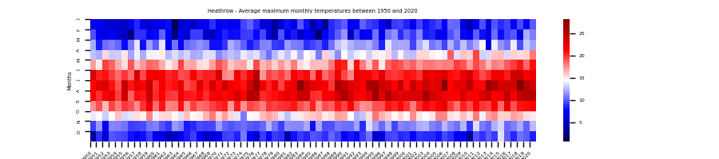
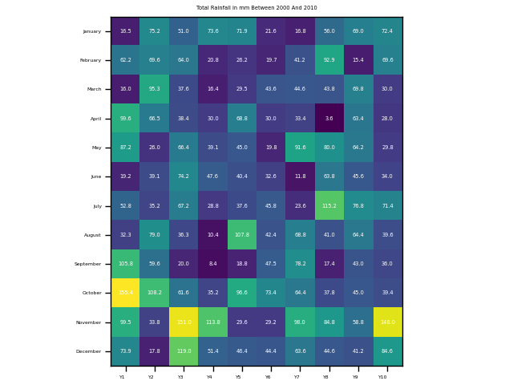
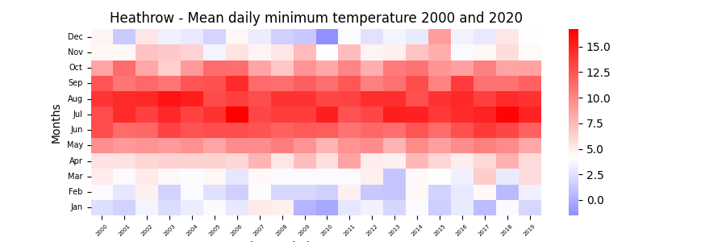

# heatmap_weather
Heatmap to visualise weather data from London Heathrow

Historic [weather] Station Data is freely available to download from the MET office website here: https://www.metoffice.gov.uk/research/climate/maps-and-data/historic-station-data

1. A heatmap to visualise weather data over the last 70 years at London Heathrow.

2. A heatmap to visualise a decade of total rainfall in mm each month.

3. A heatmap to visualise average monthly minimum temperature over 20 years.

Instructions for use:
Install the requirements; pandas, matplotlib, seaborn, numpy
1. To generate a heatmap to show the maximum temperatures over the last 70 years, run the code heathrow_weather_heatmap.py, also prints the head of the data to the terminal.

2. To generate a heatmap to show the monthly total of sunshine hours over a specific decade, run the code heathrow_weather_data_grid.py, also prints the numpy grid to the terminal.

3. To generate a heatmap using 3 specified arguments; start date, end date & selected column to view, heathrow_weather_heatmap_alldata.py 2000 2020 2 (where start date is 2000, end date is 2020 and "2" denotes that we wish to view column 2 - Mean Daily Miniumum Temperature), also prints head and tail to terminal.

Challenges Overcome:
- Cleaning up the data by skipping the first 6 rows of written explanation of the data, renaming the columns, and removing the # symbol from the sunshine hours from September 2005 onwards. The # denoted use of an alternative sensor.
- Recognising how the numpy data grid generates the data and that January is located in the top left rather than the bottom left.

Challenges not overcome:
- In order to use the data I had to manually remove all the data from 2021, stopping the data at December 2020 instead, as this created a column problem.
- Still working on air frost and total sunshine hours in the final example
